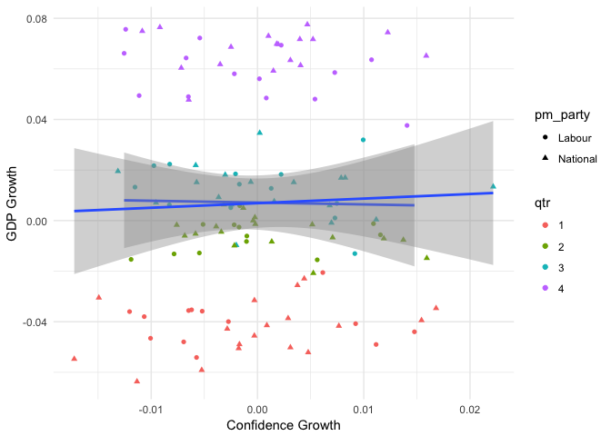
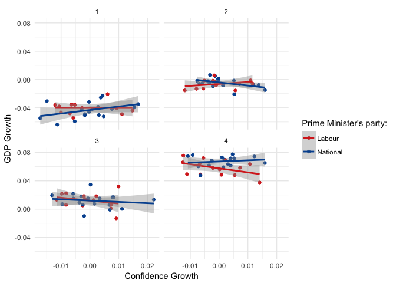
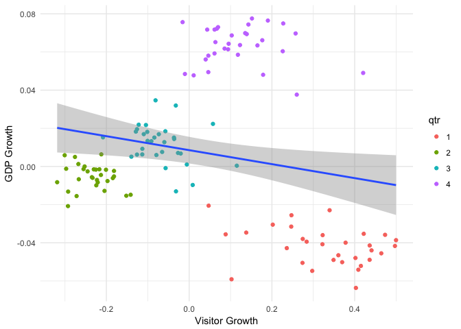
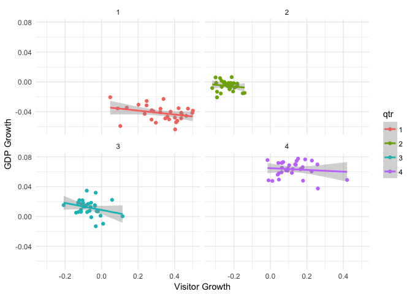

This is my version of New Zealand business confidence and growth. You can think of it as an alternative view to Peter Ellis's analysis, which reflects my (different) approach and assumptions about the data. Peter's analysis should be read first, over here:

http://freerangestats.info/blog/2018/08/01/business-expectations

...as I will be borrowing chunks of his code, and expecting people to have already read his explanation of the data and the context.

## Points of difference

Business confidence is recorded monthly. GDP is recorded quarterly. So there has to be some decision about how to match the two together. Rather than aggregate the monthly entries to make a quarterly entry, I am making the decision to use only the first month of the quarter. My thinking is that if business confidence relates to present or future GDP conditions, then it is reasonable to relate a month to the following three month period (inclusive).

Then, as Peter found, there is seasonality in the data. So that to needs a decision on how to handle it. I am making that decision that if business confidence is linked to GDP, then the cycles should be reflected as well. So I am keeping the seasonality in initially and exploring the effects of it.

## Starting off

Starting off by loading my helper libraries of choice for this occasion.


```r
library(dplyr)
library(tidyr)
library(ggplot2)
library(lubridate)
library(nzelect) 
library(scales)
```

Download the data and save it locally (once)


```r
if(!file.exists("DP_LIVE_01082018094138947.csv")){
  # thanks Peter
  download.file("https://github.com/ellisp/blog-source/blob/master/_working/DP_LIVE_01082018094138947.csv?raw=true",
              destfile = "DP_LIVE_01082018094138947.csv")
  # see https://data.oecd.org/leadind/business-confidence-index-bci.htm
  }
if(!file.exists("SNE445001_20180801_075329_92.csv")){
download.file("https://raw.githubusercontent.com/ellisp/blog-source/master/_working/SNE445001_20180801_075329_92.csv",
              destfile = "SNE445001_20180801_075329_92.csv")
  # Total GDP, chain volume, production measure
  }
```

Read in the data


```r
bc <- read.csv("DP_LIVE_01082018094138947.csv", stringsAsFactors = FALSE) %>%
  mutate(dte = ymd(paste0(TIME,"-15")),
         yr = year(dte),
         qtr = quarter(dte),
         mnth = month(dte)) %>%
    filter(LOCATION == "NZL")

gdp <- read.csv("SNE445001_20180801_075329_92.csv", stringsAsFactors = FALSE, skip = 1,
                col.names=c("yr_qtr", "gdp_p_cv")) %>%
  filter(!is.na(gdp_p_cv)) %>%
  separate(yr_qtr, into=c("yr","qtr"), sep="Q", convert=TRUE)

# monthly party in power, from https://en.wikipedia.org/wiki/List_of_Prime_Ministers_of_New_Zealand

bc_gdp <- data_frame(dte = ymd(c("1957-12-15", "1960-12-15", "1972-12-15",
                                 "1975-12-15", "1984-07-15", "1990-11-15",
                                 "1999-12-15", "2008-11-15", "2017-10-15")),
                     pm_party = c("Labour", "National", "Labour",
                                  "National", "Labour", "National",
                                  "Labour", "National", "Labour")) %>% 
  right_join(bc, by = "dte") %>% 
  fill(pm_party) %>%
  filter(mnth %in% c(1,4,7,10)) %>%
  inner_join(gdp, by = c("yr", "qtr")) %>%
  mutate(qtr = as.factor(qtr))
```

## Comparison

As GDP is growing (in general) over the decades, rather than comparing raw (scaled) confidence with raw gdp, I am going to compare proportion change in confidence relative to 3 months ago with proportion change in GDP relative to the previous quarter, an displaying it in basic linear model terms to get a sense of the relationship.


```r
bc_gdp %>%
  mutate(delta_gdp = gdp_p_cv / lag(gdp_p_cv) - 1,
         delta_confidence = Value / lag(Value) - 1) %>%
  filter(!is.na(delta_gdp)) %>%
  ggplot(aes(x = delta_confidence, y = delta_gdp, shape = pm_party)) +
  geom_point(aes(colour=qtr)) + geom_smooth(method="lm") +
  ylab("GDP Growth") + xlab("Confidence Growth") + theme_minimal()
```

<!-- -->

Ooookay. Let's start with the relationship is so noisy that business confidence cannot be said to have a relationship with GDP. The theoretical relationship itself might have confidence matching GDP, or it might be opposite. You can't clearly distinguish anything about GDP growth in a quarter from the confidence in the first month of that quarter.

Then, lets raise the fact the the seasonality is completely dominant relative to the confidence effects, based on the bands of colour separated on the vertical. So any confidence relationship is miniscule compared to the general seasonality.

Finally, with the uncertainties you can't actual tell if GDP is likely to increase or decrase as confidence increases (the error ranges of the slope cross over being horizontal), so there is no describably relationship there.

But because seasonality is so strong, let's break it down a bit.


```r
bc_gdp %>%
  mutate(delta_gdp = gdp_p_cv / lag(gdp_p_cv) - 1,
         delta_confidence = Value / lag(Value) - 1) %>%
  filter(!is.na(delta_gdp)) %>%
  ggplot(aes(x = delta_confidence, y = delta_gdp, colour = pm_party)) +
  geom_point() + geom_smooth(method="lm") + facet_wrap(~qtr, ncol=2) +
  ylab("GDP Growth") + xlab("Confidence Growth") + theme_minimal() +
  scale_colour_manual("Prime Minister's party:", values = parties_v)
```

<!-- -->

I would say:

There is no relationship. These are functionally horizontal lines.

In some quarters the relation is positive (GDP goes up as Confidence goes up), in some quarters the relationship is negative (GDP goes down as confidence goes up)

## Another question

Another question I wanted to explore in relation to this, when thinking about "Is confidence a good indicator of GDP" is the "compared to what" aspect. So I decided to make a similar graph based on monthly number of visitors arriving in New Zealand (Source, Stats NZ Infoshare - Tourism - ITM).


```r
if(!file.exists("ITM330701_20180802_054057_72.csv")){
download.file("https://raw.githubusercontent.com/thoughtfulbloke/gdpbus/master/ITM330701_20180802_054057_72.csv",
              destfile = "ITM330701_20180802_054057_72.csv")
  # Visitor arrival totals (Monthly)
  }

vst_gdp <- read.csv("ITM330701_20180802_054057_72.csv", stringsAsFactors = FALSE, 
                    skip = 1, col.names=c("yr_mnth", "visitors")) %>%
  filter(!is.na(visitors)) %>%
  separate(yr_mnth, into=c("yr","mnth"), sep="M", convert=TRUE)   %>%
  mutate(dte = ISOdate(yr,mnth,15),
         qtr = quarter(dte)) %>% 
  filter(mnth %in% c(1,4,7,10)) %>%
  inner_join(gdp, by = c("yr", "qtr")) %>%
  mutate(qtr = as.factor(qtr))
```

And the graph is:


```r
vst_gdp %>%
  mutate(delta_gdp = gdp_p_cv / lag(gdp_p_cv) - 1,
         delta_visitors= visitors / lag(visitors) - 1) %>%
  filter(!is.na(delta_gdp)) %>%
  ggplot(aes(x = delta_visitors, y = delta_gdp)) +
  geom_point(aes(colour=qtr)) + geom_smooth(method="lm") +
  ylab("GDP Growth") + xlab("Visitor Growth") +
  theme_minimal()
```

<!-- -->

Well. That's cool and bizarre. And probably needs more explanation:

The line of best fit should be ignored. The seasonal differences are so great that we are in Simpson's paradox territory.

Both GDP and Visitor numbers are very strongly seasonal, and it is not the same pattern (the clusters do not form a line). It would be the same pattern - both rising from quarter 2 to 4, but in quarter 1 (summer) NZ gets the most visitors (right hand end) but has the lowest GDP growth (lower end), maybe because NZ people are also on holiday in the summer.

Allowing for the different 1st quarter, seasonality by itself is much better than confidence in picking GDP growth, so if you didin't know the season (which is pretty unlikely) visitor growth would be a pretty good predictor of GDP growth (in effect, using visitor growth to predict season, then season to predict GDP growth)

Taking a within season look:


```r
vst_gdp %>%
  mutate(delta_gdp = gdp_p_cv / lag(gdp_p_cv) - 1,
         delta_visitors= visitors / lag(visitors) - 1) %>%
  filter(!is.na(delta_gdp)) %>%
  ggplot(aes(x = delta_visitors, y = delta_gdp, colour=qtr)) +
  geom_point() + geom_smooth(method="lm") +
  ylab("GDP Growth") + xlab("Visitor Growth") + 
  facet_wrap(~qtr, ncol=2) +
  theme_minimal()
```

<!-- -->

It is mild, and would need more teasing out, but it does look like within each season there is a slight negative relationship between visitor numbers and GDP. As visitor numbers grow GDP gets worse. It is pretty mild, but what makes it more interesting than the confidence subgroups is the consistency across all the seasons- the points are very much on the lines, and the lines are all telling the same story.

The negative relationship may be nothing, or it may be an effect like vistors do economic activity not captured well in GDP. But, coming back to the reason I went to look at this, if I had to predict GDP on the basis of confidence or visitor numbers, I would much rather use visitor numbers.

